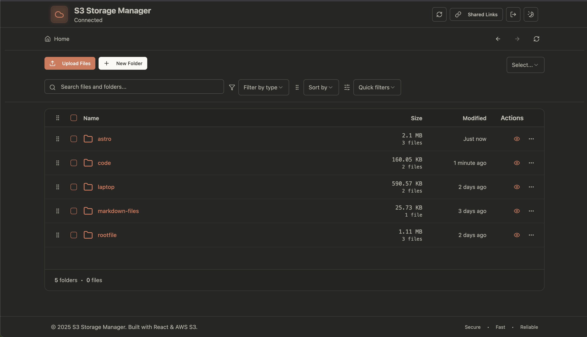
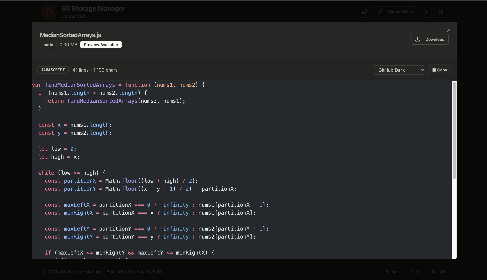

# S3 Storage Manager

A modern, minimal, and fast file browser and manager for Amazon S3, built with React, Vite, and Tailwind CSS. Easily upload, download, preview, share, and organize files and folders in your S3 buckets with a beautiful UI.

## Features

- 🔥 Fast, responsive UI with React + Vite + Tailwind CSS
- 📁 Browse, upload, download, move, rename, and delete files/folders
- 🔍 Search and filter files with instant feedback
- 🖼️ File preview for images and supported formats
- 🔒 Uses signed URLs for secure file access and sharing with time limits
- 🌗 Light/dark mode toggle
- 🧩 Modular, reusable component structure

## Getting Started

### Prerequisites

- Node.js (v18+ recommended)
- pnpm (or npm/yarn)
- AWS Account with S3 access

### Installation

```bash
pnpm install
# or
npm install
```

### Running the App

```bash
pnpm dev
# or
npm run dev
```

The app will be available at `http://localhost:5173`

## 🔧 AWS Setup

### 1. Create IAM User & Credentials

1. Open the [AWS IAM Console](https://console.aws.amazon.com/iam/home#/users)
2. Click **Create user** and enter a username (e.g. `s3-manager-user`)
3. For access type:
   - **Programmatic access** (for API/CLI access)
   - Console access (optional, for web interface)
4. Attach policy:
   - `AmazonS3FullAccess` (for quick testing)
5. Complete user creation
6. **Important:** Download the credentials immediately:
   - Access Key ID
   - Secret Access Key (will not be shown again)

### 2. Create an S3 Bucket

1. Open the [S3 Console](https://s3.console.aws.amazon.com/s3/buckets)
2. Click **Create bucket**
3. Enter a unique bucket name
4. Select your region and create the bucket

### 3. Configure CORS

1. In your bucket, go to the **Permissions** tab
2. Scroll to **Cross-origin resource sharing (CORS)** and click **Edit**
3. Paste the following JSON configuration:

```json
[
  {
    "AllowedHeaders": ["*"],
    "AllowedMethods": ["GET", "PUT", "POST", "DELETE", "HEAD"],
    "AllowedOrigins": ["*"],
    "ExposeHeaders": ["ETag"],
    "MaxAgeSeconds": 3000
  }
]
```

This enables browser uploads/downloads via JavaScript.

### 4. use `AmazonS3FullAccess` policy

### Building for Production

```bash
pnpm build
# or
npm run build
```

### 5. Screenshots

##### 1.Dashboard
  

##### 2.Code Preview
 

## 📝 License

This project is licensed under the MIT License - see the [LICENSE](LICENSE) file for details.

## 🌟 Support

If this project helped you, please consider giving it a ⭐ on GitHub!